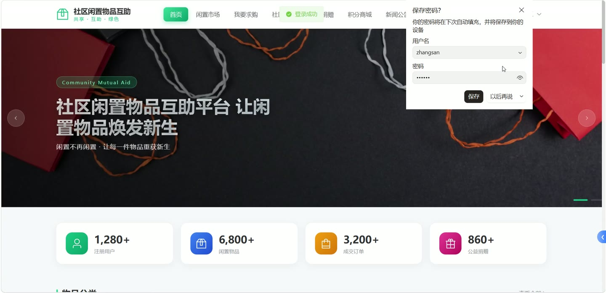
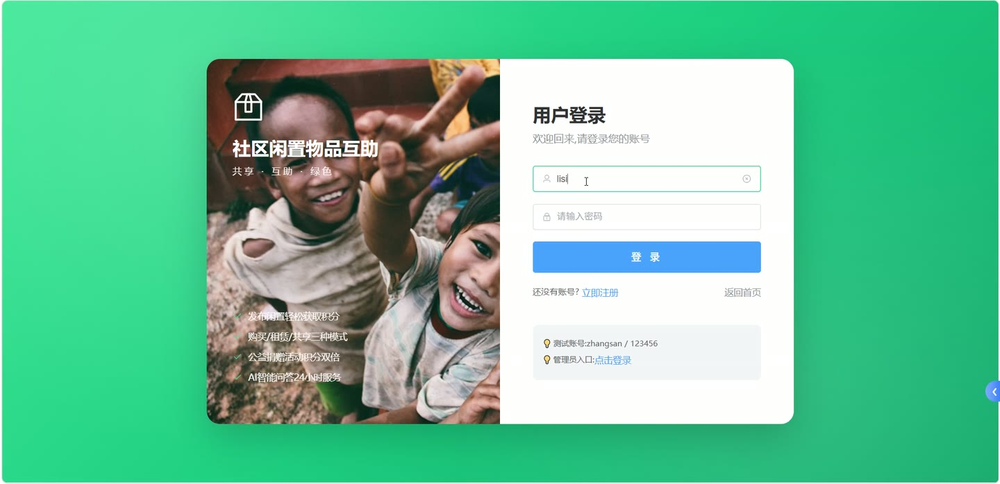
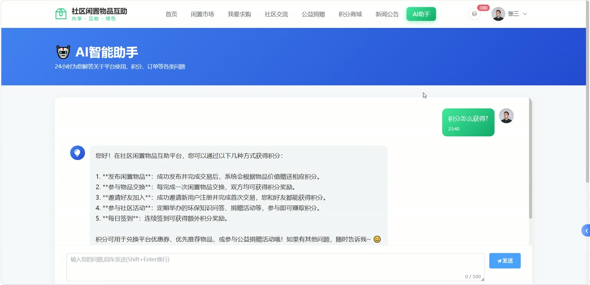

# (附文档)Springboot3+Vue3+MySQL 社区闲置物品互助系统

**技术栈**：Springboot3、Vue3、MySQL

### 系统简介

本系统是一套基于 Spring Boot 3 + Vue 3 + MySQL 构建的社区闲置物品互助平台，采用前后端分离架构。平台包含普通用户端和管理员端两大角色，支持用户发布闲置物品（赠送/交换/租赁）、发布求购信息、参与捐赠活动、积分兑换商品、社区交流论坛、AI 智能问答等功能，管理员可对平台内容进行审核与数据统计。
 
### 核心功能
 
### 普通用户端

 
- 注册/登录：用户通过用户名、密码、昵称完成注册，登录后获取 JWT Token 进行身份认证。 
- 发布闲置物品：填写物品标题、描述、分类、图片、交易模式（赠送/交换/租赁）、价格/租金、成色、位置等信息，提交后等待管理员审核。 
- 查看物品列表：按分类、模式、关键词筛选物品列表，支持分页浏览。 
- 物品详情：查看物品完整信息（含发布者昵称、头像、分类名称），支持点赞和浏览计数。 
- 发布求购信息：填写求购标题、描述、预算范围（最低价/最高价）、分类，提交后等待管理员审核。 
- 求购列表/详情：查看所有审核通过的求购信息，可查看发布者联系方式（手机、邮箱）。 
- 创建订单：对物品下单（支持购买/交换/租赁），填写收货地址、备注，生成订单。 
- 订单管理：查看个人订单列表（按状态筛选），支持支付、取消订单，查看订单详情（含物品封面、买卖双方名称）。 
- 收货地址管理：添加/编辑/删除收货地址，设置默认地址，包含省/市/区/详细地址。 
- 发布社区帖子：在社区交流模块发布帖子（标题、内容、图片），支持浏览计数和点赞计数。 
- 社区帖子列表/详情：按状态筛选帖子列表，查看帖子详情（含发布者信息），支持点赞操作。 
- AI 智能问答：向 AI 提问，系统调用 DeepSeek API 返回回答，并保存对话记录。 
- 参与捐赠活动：查看捐赠活动列表，提交捐赠物品（名称、描述、图片、数量），等待管理员审核并获取积分。 
- 积分商品兑换：查看积分商品列表（含封面、所需积分、库存），提交兑换订单（填写收货信息），消耗积分。 
- 兑换订单管理：查看个人兑换订单列表（含商品封面、订单状态），支持确认收货。 
- 积分记录：查看积分变动明细（类型、来源、描述）。 
- 提交反馈：填写反馈类型、标题、内容、联系方式，提交给管理员。 
- 举报内容：对物品、帖子等目标提交举报（选择目标类型、原因、描述）。 
- 个人中心：查看/编辑个人资料（昵称、头像、手机、邮箱、性别、生日、个人简介），修改密码。 
- 公告查看：浏览系统公告列表（支持按类型筛选），查看公告详情。
 
### 管理员端

 
- 管理员登录：使用用户名和密码登录后台管理系统。 
- 仪表盘：查看平台概览数据（订单总数、交易总额等），以及订单月趋势、订单状态分布、物品分类分布、物品模式分布、物品月趋势、捐赠月趋势、捐赠用户排名等图表数据。 
- 用户管理：分页查看用户列表（按用户名/昵称/手机号模糊搜索、按状态筛选），新增/编辑用户，重置用户密码（默认 123456），删除用户。 
- 物品管理：分页查看物品列表（按状态/分类/模式/关键词筛选），查看物品详情，审核物品（通过/驳回并填写审核备注），编辑物品信息，删除物品。 
- 求购管理：分页查看求购列表（按状态/关键词筛选），审核求购（通过/驳回并填写审核备注），删除求购。 
- 订单管理：分页查看所有订单（按状态/订单类型/关键词筛选），查看订单详情（含物品信息、买卖双方），删除订单。 
- 分类管理：查看分类列表（按排序字段排列），新增/编辑/删除分类（名称、图标、排序、描述）。 
- 轮播图管理：查看轮播图列表（按排序字段排列），新增/编辑/删除轮播图（标题、图片、链接、排序、状态）。 
- 公告管理：分页查看公告列表（按类型/关键词搜索，置顶优先），查看公告详情，新增/编辑/删除公告（标题、封面、内容、类型、是否置顶）。 
- 社区交流管理：分页查看帖子列表（按状态/关键词筛选），审核帖子（更新状态），删除帖子。 
- 评论管理：分页查看评论列表（按状态/关键词筛选），审核评论（更新状态），删除评论。 
- 捐赠活动管理：分页查看捐赠活动列表（按状态筛选），新增/编辑/删除活动（标题、封面、描述、积分规则、起止时间）。 
- 捐赠记录管理：分页查看捐赠记录（按状态/活动筛选），审核捐赠（通过/驳回，可设置奖励积分和备注），删除记录。 
- 积分商品管理：分页查看积分商品列表（按状态/类型/名称关键词筛选），新增/编辑/删除商品（名称、封面、描述、所需积分、库存、类型）。 
- 兑换订单管理：分页查看兑换订单列表（按状态/关键词筛选），执行发货操作，执行完成操作。 
- 反馈管理：分页查看反馈列表（按状态/类型/关键词筛选），回复反馈（填写回复内容，状态自动变为已回复），删除反馈。 
- 举报管理：分页查看举报列表（按状态/目标类型筛选），处理举报（通过/驳回并填写处理备注）。 
- 操作日志：分页查看操作日志（按模块/操作人/状态筛选），查看日志详情（操作人、模块、操作、请求方法、IP、耗时、状态等），一键清空日志。 
- 管理员信息：查看当前管理员信息，修改密码（需提供旧密码），更新个人资料（真实姓名、头像、手机、邮箱）。
 
### 技术栈

 后端框架Spring Boot 3.x ORMMyBatis-Plus 权限认证JWT（jjwt） 前端框架Vue 3 状态管理Pinia 构建工具Vite 数据库MySQL 文件上传Hutool + MultipartFile AI 集成DeepSeek API
 
### 交付内容

 
- 后端完整源码 
- 前端完整源码 
- 数据库初始化脚本 
- 万字文档

## 界面展示

---

## 获取完整源码 + 万字文档

本仓库为项目介绍页。**完整前后端源码、数据库初始化脚本、万字项目文档**，请加微信 `kangkangcode`，或访问 [codekk.top](http://codekk.top) 获取。

可作课程设计 / 毕业设计参考，支持远程部署调试。